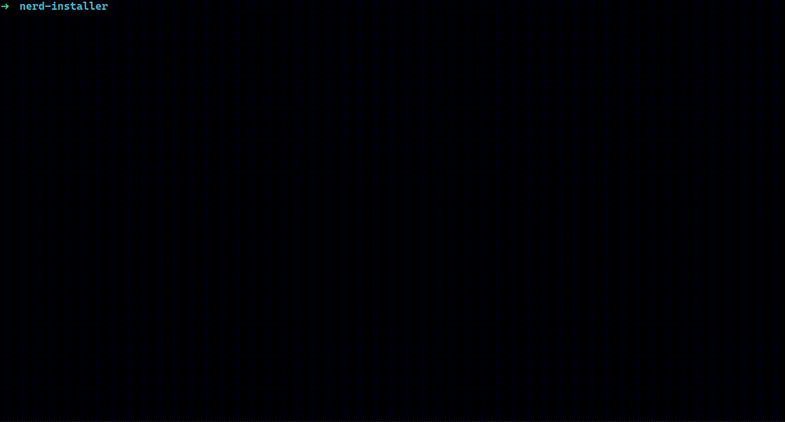

# Nerd Installer

📥 `Nerd Installer` is a CLI for installing nerd fonts.

## 📷 Preview



## ⚙️ Installation and usage

```sh
git clone https://github.com/surajkareppagol/nerd-installer
cd nerd-installer
```

```sh
make
```

## 🛠️ Requirements

`Nerd Installer` depends on `libzip`, `libncurses` and `libcurl`.

```sh
sudo apt install libzip-dev
```

```sh
sudo apt install libncurses-dev
```

```sh
sudo apt install libcurl4-gnutls-dev
```

## ✅ To do

- Check for memory leaks
- Improve CLI UI
- Handle errors
